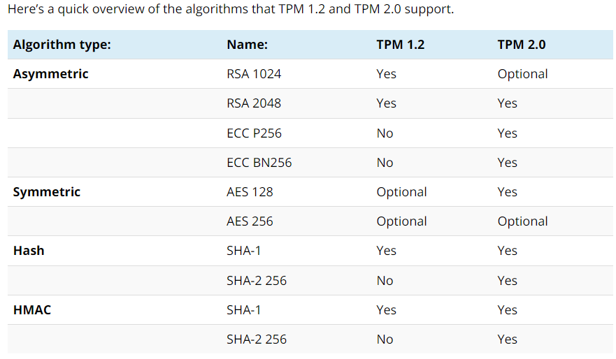
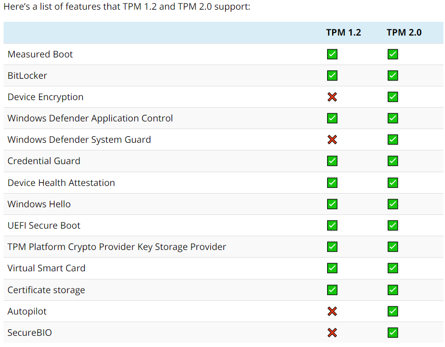

[Back to Main Page](../index.html) 

# TPM and Windows 11

## What even is TPM?

The Trusted Platform Module (TPM) designed by TCG allows the storage of passwords, encryption keys and digital certificates. 

Think of it like a hardware password manager for low level systems, it generates and stores keys based on the configuration of the system. Incorporating TPM into your encryption means you're fending off people trying to decrypt data on a different system from the one it was encrypted with. Using TPM alone would be stupid - hardware failures happen - but when used alongside other methods it's a barrier that blocks off certain types of attack.

TPMs are also used by some apps and web services. For instance, Outlook uses a TPM for handling encrypted emails. Web browsers, on the other hand, utilize it for maintaining SSL certificates used to authenticate and create encrypted connections with websites.

## TPM 1.2 versus TPM 2.0

As is the case with most types of tech, iterations with higher numbers aren’t just newer, but they come with better features too. In particular, TPM 2.0 supports [more and newer cryptographic algorithms than its predecessors](https://trustedcomputinggroup.org/resource/tcg-algorithm-registry/). This means it can generate keys that are harder to break, making devices that use it more difficult for hackers to infiltrate.

  
*source windowsreport.com*  

TPM 1.2 only uses the SHA-1 hashing algorithm, which is a problem since SHA-1 isn’t secure, and many agencies started moving to SHA-256 in 2014.

Microsoft and Google removed the support for SHA-1 based signing of certificates in 2017. It’s also worth mentioning that TPM 2.0 supports newer algorithms that will improve drive signing and key generation performance.

TPM 2.0 also offers a more consistent experience, and the lockout policy is configured by Windows. With TPM 1.2, the implementations vary by policy settings, which can be a security concern.

  
*source windowsreport.com*  

## Check for TPM version

There multiple wats to check for the TPM Version.

1.) Microsoft PC Health Check App
2.) Run the Trusted Platform Module Test (tpm.msc)
3.) Use the Windows Security App

## Bypass Windows 11 TPM requirements

What if your TPM version is below 2.0? Can you still install Windows 11 on your device? Yes, you can bypass the TPM 2.0 requirement safely without compromising your device. Here's how to go about it. Microsoft developed this tweak, so you can be sure of its reliability. That doesn't mean it endorses or supports installing Windows 11 on devices that don't meet its requirements, though.

`regedit`  
There, a new DWORD (32-bit) needs to be added in `HKEY_LOCAL_MACHINE\SYSTEM\Setup\MoSetup` with following variables:
`AllowUpgradesWithUnsupportedTPMOrCPU` set to 1.  
  
On a fresh install, this variable can be set by using SHIFT and F10 to get into the cmd.
  
`regedit.exe`  
This time navigate to `HKEY_LOCAL_MACHINE\SYSTEM\Setup` instead and set up a key called `LabConfig`. Then, inside this newly created LabConfig key more DWORD (32-bit) variables must be created.  

`BypassTPMCheck` set to 1  
`BypassRAMCheck` set to 1  
`BypassSecureBootCheck` set to 1  

## Why you should NOT circumvent Windows 11 TPM requirements

When it comes to bypassing Windows 11's hardware requirements, especially if these have something to do with security, just remember this adage: "Just because you can, doesn’t mean you should." 

### TPM 2.0 is more advanced than TPM 1.2
As is the case with most types of tech, iterations with higher numbers aren't just newer, as we have figured earlier. 

### Compatibility issues may arise
Like any software manufacturer worth their salt, Microsoft tested Windows 11 extensively prior to the product’s release and they very likely did so on supported devices. Therefore, running the new OS on devices that don’t meet hardware specifications may result in compatibility issues that can lead to various problems, ranging from glitches to outright failure. 

### Microsoft won't release updates for unsupported devices
The software giant temporarily relaxed some of its restrictions and allowed unsupported devices to run Windows 11 for some time. They made it clear, however, that unsupported devices won’t be receiving any future updates.

## Future of TPM in Quantum Computing

The European cooperative research project FutureTPM officially started on January the 1st 2018 and is coordinated by the Austrian company TECHNIKON. Under the technical lead of the University of Surrey, the project team will research a Quantum-Resistant (QR) TPM by designing and developing QR algorithms suitable for inclusion in a TPM.
