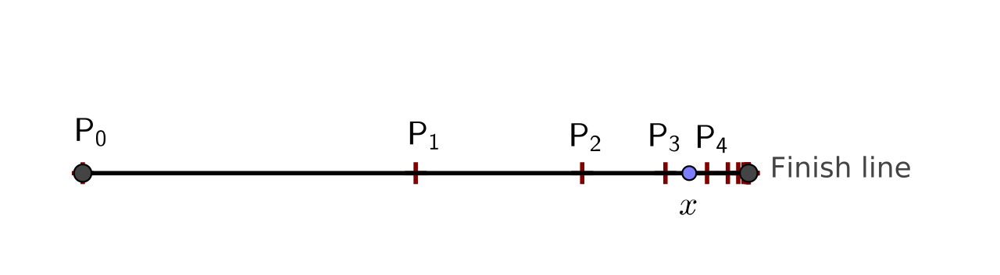
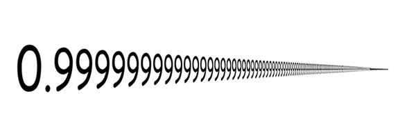

[Back to Main Page](../index.html) 

# 0.999...

## 0.999... is equal to 1

Recently I stumbled across a repeating decimal notation - 0.999... - with a very interesting characteristic.  
This number is equal to 1. In other words, "0.999..." is not "almost exactly" or "very, very nearly but not quite" 1  –  rather, "0.999..." and "1" represent exactly the same number.  
  
If you have never had a closer look at this number, you will probably believe that this is just nonsense. But it isn't. There are multiple ways to proof that 0.999... is equal to 1.  

  
*source: https://polymathematics.typepad.com*  
  
Down below are a few of the many ways of showing this equality.

## Algebraic argument

The standard algebric proof runs something like this, presented by William Byers in 'How Mathematicians Think: Using Ambiguity, Contradiction, and Paradox to Create Mathematics'.  
  
  
*source: https://wikipedia.org*  
  
Surely if 9x = 9, then x = 1. But since x also equals 0.099... we get that 0.099... = 1. The algebra is impeccable.  

## Another algebraic argument

Not convinced yet? Here is another algebraic argument.

**1 / 3 of 1 equals 0.333..., but multiplying this with 3 gives 1 = 0.999**
  
Odd, right?  

I've once read a comment, which I think fits in here.  

*It's best if you don't try to look at 0.999... as a 'normal' number. Once you start dealing with anything infinite, your common sense concept of how things work sort of goes out the window.*

## Intuitive explanation

If one places 0.9, 0.99, 0.999, etc. on a number line, they can immediately see that all these points are to the left of 1, and that they get closer and closer to 1.

More precisely, the distance from 0.9 to 1 is 0.1 = 1/10, the distance from 0.99 to 1 is 0.01 = 1/102, and so on. The distance to 1 from the nth point (the one with n 9s after the decimal point) is 1/10n. This point would be at a positive distance from 1 that is less than 1/10n for every integer n. In the standard number systems, there is no positive number that is less than 1/10n for all n.

Therefore, 1 is the smallest number that is greater than all 0.9, 0.99, 0.999, etc., and so 1 = 0.999....

  
*source: https://wikipedia.org*  

## Conclusion

0.999 is a weird number, but it is also 1. 

  

