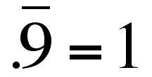
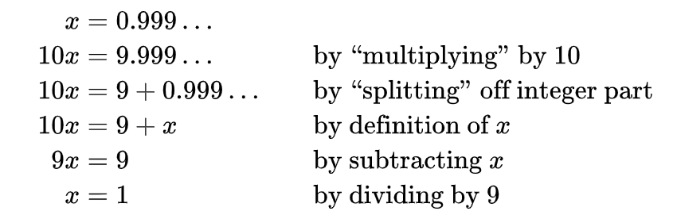

[Back to Main Page](../index.html) 

# 0.999...

## 0.999... is equal to 1

Recently I stumbled across a repeating decimal notation - 0.999... - with a very interesting characteristic.  
This number is equal to 1. In other words, "0.999..." is not "almost exactly" or "very, very nearly but not quite" 1  –  rather, "0.999..." and "1" represent exactly the same number.  
  
If you have never had a closer look at this number, you will probably believe that this is just nonsense. But it isn't. There are multiple ways to proof that 0.999... is equal to 1.  

*source: https://polymathematics.typepad.com/*  
  
Down below are a few of the many ways of showing this equality.

## Algebraic argument

The standard algebric proof runs something like this, presented by William Byers in 'How Mathematicians Think: Using Ambiguity, Contradiction, and Paradox to Create Mathematics'.  
  

  
Surely if 9x = 9, then x = 1. But since x also equals 0.099... we get that 0.099... = 1. The algebra is impeccable.  

## Another algebraic argument

Not convinced yet? Here is another algebraic argument.

**1 / 3 of 1 equals 0.333..., but multiplying this with 3 gives 1 = 0.999**

