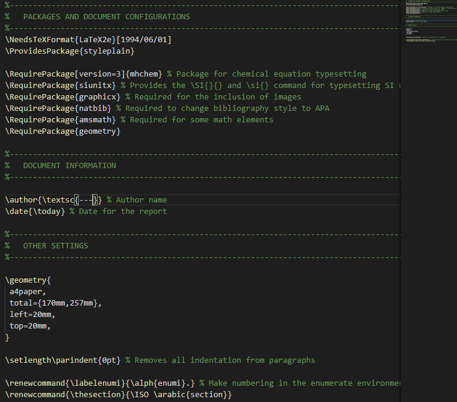
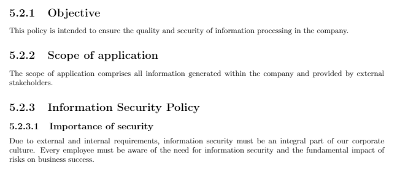
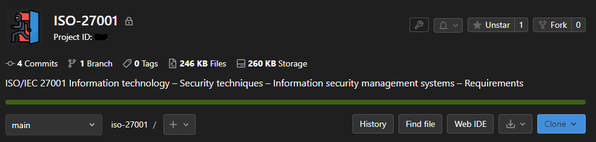
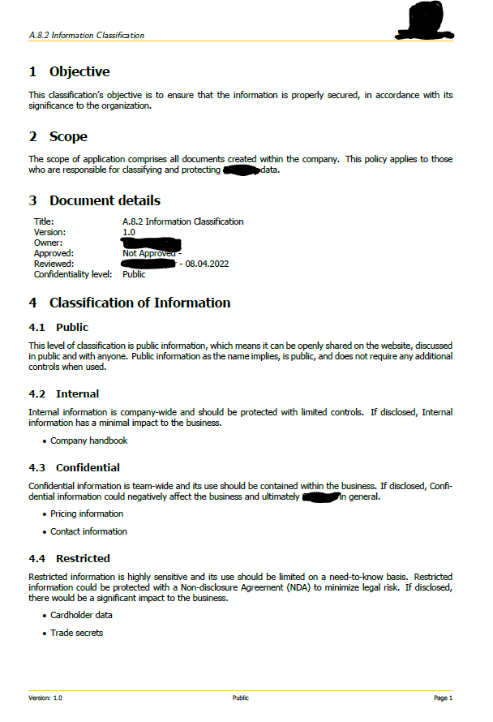
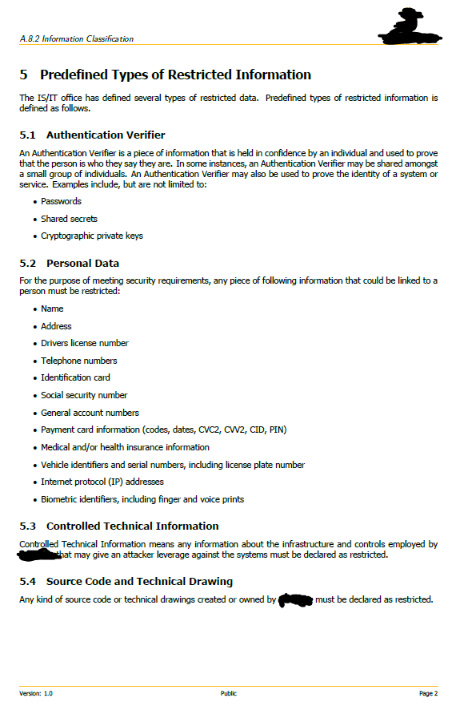

[Back to Main Page](../index.html) 

# Implementing ISO 2700


## Setting up ISO 27001

While I am beginning to write on this, I realize that this will not be any blog post like my others; rather, this will be much more in-depth including considerations as well as mistakes on a project that I have recently undertaken. Over the next few months, I will be attempting to create all the necessary files and documentation for a corporate organization to be certified to ISO 27001.  

I would like to note that this is certainly not a tutorial or best practice, but merely my own journey towards it.

## Document structure in LaTeX

From the beginning of the implementation I immediately understood how crucial it would be, to build up a reasonably functional LaTeX structure. This would enable me to easily modify, generate and backup the files.  
  
My very basic folder structure in the first week looked like this, including style sheets and VSCode workspace configurations.

    ├── ...
    ├── images                                              
    ├── sections                                            # LaTeX files
    │   ├── references                                      
    │   │   ├── 5.2 Information security policy.pdf         # generated PDF
    │   │   ├── 6.1.2 Information security risk assessment.pdf
    │   │   ├── 5.2 Information security policy.fdb_latexmk
    │   │   ├── 5.2 Information security policy.fls    
    │   ├── 5.2 Information security policy.tex             # .tex Files for every Policy
    │   ├── 6.1.2 Information security risk assessment.tex  
    │   └── style.sty                                       # style sheet
    ├── ISO 27001.workspace.code-workspace                  # VSCode workspace configuration
    └── ...

The workspace configuration was an important part, as the files genereted in references usually would create a big file mess in the main folder. Tidying the whole thing up, I wanted the LaTeX generated files to stay in a subfolder \references.

This are the settings that allowed me to do this:

```
{
    "folders": [
        {
            "path": "."
        }  
    ],
    "settings": {
        "latex-workshop.latex.outDir": "%DIR%/references"
    }
}
```

## Basic .sty stylesheet

Since the design will always be the same in each layout, I decided to create a .sty file. This allows me to put an ever increasing part of the code into a predefined document.  
  
  

In a documentation I've noticed that one never should use \include to load a file with personal definitions and packages. \include should only be used in the document environment, for big chunks of text, typically a unit like a chapter. 

Now most parts of the design can be called easily with a simple line of code.

```
\documentclass{article}
\usepackage{style}
```

## Writing the first document

Almost all online resources on ISO 27001 recommend starting with 5.2 - the information security policy. It is intended to be the primary file and provide the structure for all other and further documentation. It is not meant to be overly in depth, but should allow for a good overview of goals and scopes.  
  
Here is an early version of this data, one of the first things that have been written down.  
  
  

A big list of all mandatory documents as well as additional documentation, records and evidence needed can be found here: [ISO27k ISMS mandatory documentation checklist](https://www.iso27000.es/assets/files/ISO27k%20ISMS%20Mandatory%20documentation%20checklist%20release%201v1.docx)

## Document structure revised

By the time I was less than halfway through writing my first documentation, I realized something: I wanted the PDF files to be more accessible. To separate the file we want (the .pdf file) from the extra stuff, after the build we need to copy it somewhere else. For example, to a different folder or to the top level. 

Here is a snipped of the reworked ISO 27001.workspace.code-workspace file.

```python
{
  "folders": [
    {
      "path": "."
    }
  ],
  "settings": {
    "latex-workshop.latex.outDir": "%DIR%/.tmp",
    "latex-workshop.latex.recipes": [
      {
        "name": "latexmk ➞ copyPDF ➞ updatepdf",
        "tools": [
          "latexmk",
          "copyPDF"
        ]
      }
    ],
    "latex-workshop.latex.tools": [
      {
        "name": "latexmk",
        "command": "latexmk",
        "args": [
          "-shell-escape",
          "-synctex=1",
          "-interaction=nonstopmode",
          "-file-line-error",
          "-pdf",
          "-outdir=%OUTDIR%",
          "%DOC%"
        ],
        "env": {}
      },
      {
        "name": "copyPDF",
        "command": "cmd.exe",
        "args": [
          "/c",
          "copy",
          "%OUTDIR%\\%DOCFILE%.pdf",
          "%DIR%/../",
        ],
        "env": {}
      },
      {
        "name": "pdfupdater",
        "label": "updatepdf",
        "dependsOn": "build",
        "command": "${command:latex-workshop.refresh-viewer}"
      },
    ],
  }
}
```

Using this custom configuration will create a directory in a different path, move the PDF file from there to a third location, and then update the vscode PDF preview. This is how the following structure ended up.  
  
  
    ├── ...                                       
    ├── sections                                            # LaTeX files
    │   ├── .tmp                                           
    │   │   ├── 5.2 Information security policy.pdf         # generated PDF
    │   │   ├── 6.1.2 Information security risk assessment.pdf
    │   │   ├── 5.2 Information security policy.fdb_latexmk
    │   │   ├── 5.2 Information security policy.fls    
    │   ├── 5.2 Information security policy.tex             # .tex Files for every Policy
    │   ├── 6.1.2 Information security risk assessment.tex  
    │   ├── __latexindent_temp.tex
    │   └── style.sty                                       # style sheet
    ├── 5.2 Information security policy.pdf                 # created PDF
    ├── 6.1.2 Information security risk assessment.pdf
    ├── ISO 27001.workspace.code-workspace                  # VSCode workspace configuration
    └── ...

## GitLab connection

At this point I finally (and probably way too late) implemented the GitLab connection and set up the repo.  
I used [this TeX.gitignore](https://github.com/github/gitignore/blob/main/TeX.gitignore) to keep the repo tidy and clean.  

  

Quickly I figured that I also want to get rid of the temporary and double created PDF files, so I added a custom ignore to the gitignore as well.  

```
## Additional custom ignores:
**/.tmp/
```

## Restructuration

Soon after creating our first actual files, we stumbled in the problems of requiring additional non-iso documents. At this point of time I have been writing on the documents for about 3 months. The current structure looks more like this now:

    ├── ...
    ├── .gitignore                                            
    ├── documents                                             # LaTeX files
    │   ├── .tmp
    │   │   ├── Backup standards.tex                          # .tex files that do not fit else
    │   │   ├── Hardening standard.tex
    │   │   ├── Tier Model Administration.tex
    ├── sections                                              # LaTeX files
    │   ├── .tmp                                           
    │   │   ├── 5.2 Information security policy.pdf           # generated PDF
    │   │   ├── 5.2 Information security policy.fdb_latexmk
    │   │   ├── 5.2 Information security policy.fls
    │   ├── __latexindent_temp.tex
    │   ├── 5.2 Information security policy.tex               # .tex files for every Policy
    │   ├── 6.1.2 Information security risk assessment.tex
    │   ├── 6.2 Information security objectives and plans.tex 
    │   └── A.8.2 Information classification.tex
    ├── style                                                 # Style configurations
    │   ├── logo.png
    │   └── style.sty
    ├── 5.2 Information security policy.pdf                   # created PDF
    ├── 6.1.2 Information security risk assessment.pdf
    ├── 6.1.2 Information security risk assessment.pdf
    ├── 6.2 Information security objectives and plans.pdf
    ├── A.8.2 Information classification.pdf
    ├── Backup standards.pdf
    ├── Hardening standard.pdf
    ├── Tier Model Administration.pdf
    ├── workspace.code-workspace                              # VSCode workspace configuration
    └── ...
    
The documents .sty started looking better and better, with help of pre-defined variables in each documents. The version history would be GitLab itself, and these adjustable variables would look like the following:

```
\documentclass{article}
\usepackage{../style/style}

\title{Tier Model Administration} % Title
\def\ISO{Tier Model Administration}
\def\version{0.1} % Version number
\def\owner{---}
\def\reviewdate{08.04.2022} % Date
\def\reviewer{---}
\def\approveddate{WIP}
\def\approver{Not Approved}
\def\confidentialitylevel{Restricted}

\begin{document}
```

And here is one of the example documents created with this configuration.

 
 
