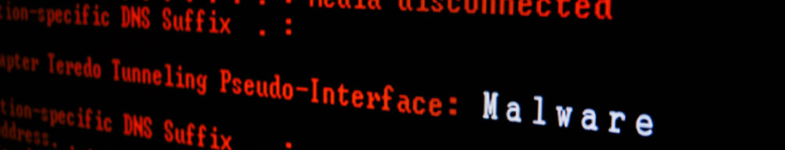

[Back to Main Page](../index.html) 

# Malware Development

## The basics

This blog will be focused on a github project in regards of development of malicious software. We will explore and try to implement multiple techniques used by malicious applications to execute code, hide from defenses and persist.  For the purpose of this and following articles we will use MS Visual Studio on Windows 10.

To start things off, we will try to create a C++ application that run malicious shellcode, trying not to be caught by AV Software.  
Why C++ and not C# or PowerShell script? Because it’s much more difficult to analyze compiled binary when compared to managed code or script.

### How detections work

Antimalware solutions are based on three types of detection mechanisms:

- Signature: inspection of file checksums (MD5, SH1,...) and presence of known strings and byte sequences in the binary
- Heuristic: application behavior and identification of characteristics (functions that are usually used in malware)
- Sandboxing: Analysis in a monitored environment

Multiple techniques to evade different mechanisms exist. For example:

- Polymorphic: To defeat signature-based detection (can also be at least multiple times recompiled).
- Obfuscation: Can evade heuristic based detection
- Conditional: Various statements that detect and bypass sandboxes
- Encoded Info: Encoding and encrypting sensitive information can help bypass signature-based detection as well as heuristic detection

### Generating Shellcode

First, we open up MS Visual Studio, and create a new project. We will be creating a Windows C++ Console Application (x86).

