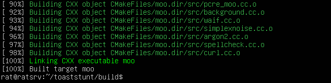

[Back to Main Page](../index.html) 

# Setting up a MOO


ToastStunt is a fork of the LambdaMOO / Stunt server.

## Basic Installation of ToastStunt

First, let's get the machine up to date.

```
sudo apt upgrade 
sudo apt update
```


Then install all the libs needed to run ToastStunt

```
sudo apt install build-essential bison gperf cmake libsqlite3-dev libaspell-dev libpcre3-dev nettle-dev g++ libcurl4-openssl-dev libargon2-dev libssl-dev
```

Then we clone the repos and copy the toastcore.db into the toaststunt directory.

```
git clone https://github.com/lisdude/toaststunt
git clone https://github.com/lisdude/toastcore
cp toastcore/toastcore.db toaststunt/toastcore.db
```


Making a build directory inside /toaststunt to make the game.

```
cd toaststunt
sudo mkdir build && cd build
sudo cmake ../
sudo make -j2
```



Starting the basic moo and run it as a background job.

```
 ./moo ../toastcore.db <database-name>.db
 < Control Z >
jobs
bg 1
```

## Run dome-client.js

dome-client.js is a webclient to use instead of a basic telnet connection. First, we're cloning the repo as well.

```
cd ..
cd ..
git clone https://github.com/javachilly/dome-client.js/
```

Install NPM, which will be needed for the webinterface.

```
sudo apt install NPM
sudo apt update
```
Next let's fetch the required update modules by using npm.

```
cd dome-client.js
npm install
```


```
sudo npm install -g forever
```

Next we will edit the config/default.js to make sure the basic information is correct.

```
nano config/default.js
< CTRL X >
```

Now we're starting the server on port 5555 in debugging mode.

```
debug.sh
```


## Connect to your Moo

Let's up telnet connection to our fresh moo.

```
telnet localhost 7777
```

Due proxy settings on local machine we will not see your logon page, connect to the wizard.

```
connect wizard
```


## Basic Commands

Set a password for yourself.
```
@password <new-password>
```

Rename and describe yourself.
```
@rename #2 to <your-name>
@describe #2 as <your-description>
```

Show kids to move to The First Room.
```
@kids #2
@kids #3
@show #62
```

Enable basic ANSI options.
```
@ansi-option +colors
@ansi-option +blinking
@ansi-option +bold
```

Setup The First Room with ANSI colors.
```
@rename #62 to [yellow]<room-name>[normal]
@describe #62 as [grey]<room-description>[normal]
```

Create new rooms with @dig.
```
@dig north,n to "The North Pole"
n
@dig south,s to #62
```

After creating a new room with @dig, we are setting the basic movement messages.
```
s

@leave north is "You make your way to the north."
@oleave north is "goes north."
@oarrive north is "walks in from the north."

n

@leave south is "You make your way to the south."
@oleave south is "goes south."
@oarrive south is "walks in from the south."
```
