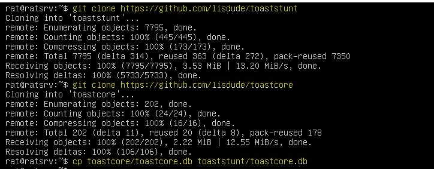

[Back to Main Page](../index.html) 

# Setting up a MOO


ToastStunt is a fork of the LambdaMOO / Stunt server.

## Basic Installation of ToastStunt

First, let's get the machine up to date.

```
sudo apt upgrade 
sudo apt update
```


Then install all the libs needed to run ToastStunt

```
sudo apt install build-essential bison gperf cmake libsqlite3-dev libaspell-dev libpcre3-dev nettle-dev g++ libcurl4-openssl-dev libargon2-dev libssl-dev
```

Then we clone the repos and copy the toastcore.db into the toaststunt directory.

```
git clone https://github.com/lisdude/toaststunt
git clone https://github.com/lisdude/toastcore
cp toastcore/toastcore.db toaststunt/toastcore.db
```



Making a build directory inside /toaststunt to make the game.

```
cd toaststunt
sudo mkdir build && cd build
sudo cmake ../
sudo make -j2
```


Starting the basic moo and run it as a background job.

```
 ./moo ../toastcore.db <database-name>.db
 < Control Z >
jobs
bg 1
```

Let's up telnet connection to our fresh moo.

```
telnet localhost 7777
```

Due proxy settings on local machine we will not see your logon page, connect to the wizard.

```
connect wizard
```

## Basic Commands

```
Set a password for yourself.
  -- @password <new-password>

@set $network.MOO_Name to "<game name>"
https://www2.hawaii.edu/~herve/MOO/


git clone https://github.com/JavaChilly/dome-client.js
sudo apt install npm
sudo apt upgrade && sudo apt update
sudo npm install
sudo npm init
sudo npm install -g forever
nano dome-client.js/config/default.js
```
