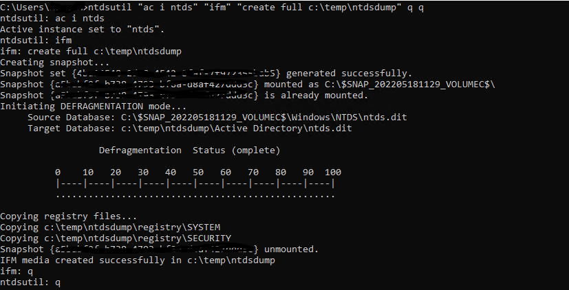
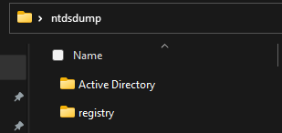

[Back to Main Page](../index.html) 

# Active Directory Password Cracking


## The basics

This blog post will teach you how to get password hashes from a domain controller and how to crack those received with different self-generated and downloaded wordlist. For the purpose of this article we will use Windows 11 and Kali Linux, attacking a real domain controller in a windows environment.

### Password hashes in the domain

Password hashes are stored in a database file in the domain controller (NTDS.DIT) with some additional information like group memberships and users. The NTDS.DIT file is constantly in use by the operating system and therefore cannot be copied directly to another location for extraction of information. This file can be found in the following Windows location:
```
C:\Windows\NTDS\NTDS.dit
```

There are various techniques that can be used to extract this file or the information that is stored inside it however the majority of them are using one of these methods:

* Domain Controller Replication Services
* Native Windows Binaries
* WMI

### Extracting the hashes

The ntdsutil is a command line tool that is part of the domain controller and its purpose is to enable administrators to access and manage the windows Active Directory database. However it can be abused by penetration testers and red teams to take a snapshot of the existing `ntds.dit` file which can be copied into a new location for offline analysis and extraction of password hashes.

With this single command we will be able to activate the ntds instance on the domain controller and create the snapshot, which will place in C:\temp of the local machine.

```
ntdsutil "ac i ntds" "ifm" "create full c:\temp\ntdsdump" q q
```

or, in case it doesn't work we could use the whole command. It's the same thing.
```
ntdsutil
activate instance ntds
ifm
create full C:\ntdsutil
quit
quit
```





